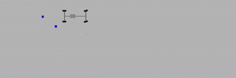

# 2D Physics Simulator (C++ / SFML)

This is a 2D physics simulation engine written in C++ using the SFML library for rendering. It was developed as a personal project to explore numerical integration techniques, physical constraints, and real-time simulation rendering.

## Overview

The project simulates physical objects in 2D space using forces and a system of constraints that connect bodies together. It uses the Runge-Kutta 4 (RK4) integration method for dynamic updates and supports compound physical systems like rigid structures.

The example shown in the demo is a top-down car built from separate physical components: a main body, individual wheels, axles, and transmission shafts. These elements are connected via constraints, demonstrating the simulation’s ability to handle interconnected, multi-body systems.

Originally developed on Windows.

## Features

- Real-time 2D simulation of particles and bodies with constraints
- Numerical integration via RK4 for improved accuracy
- Support for distance, angular and rigid constraints
- Customizable simulation parameters (drag, stiffness, damping...)
- SFML-based rendering (top-down view)
- Fully written in C++ without external physics engines

## Technical Notes

- RK4 is used for greater numerical stability, particularly with rigid or stiff systems
- The simulation loop uses a fixed timestep for determinism
- Constraints are resolved iteratively using a Jacobian-like formulation inspired by the approach in "Physically Based Modeling" (Baraff, Witkin, 1997)

## Controls / Usage

- WASD \* - for camera controls

## Known Limitations

- No collision detection or response
- Stability can be affected by complex or overlapping constraints
- No GUI for runtime configuration
- Latest commits are unstable

---
